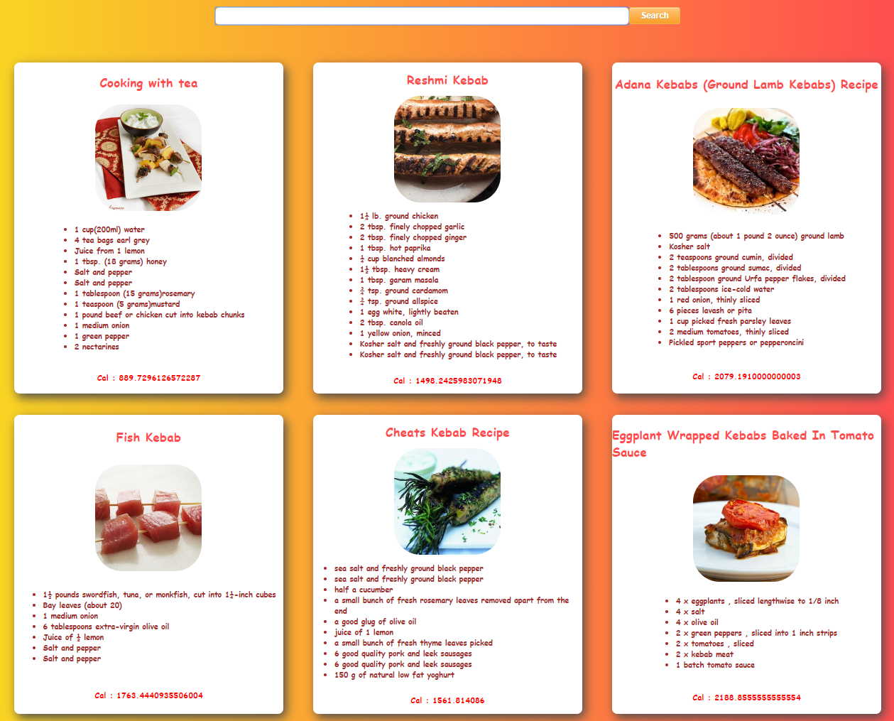

<h1>Any Recipe You Want</h1>

Are you at home because of corona virus and you want to cook something different ? Try this dude!

Search what do you want to cook and have the recipe!

<h3>Topics</h3>
<ul>
<li>React JS</li>
<li>Edamam Recipe Api</li>

</ul>

<h3>Screenshots</h3>

  

